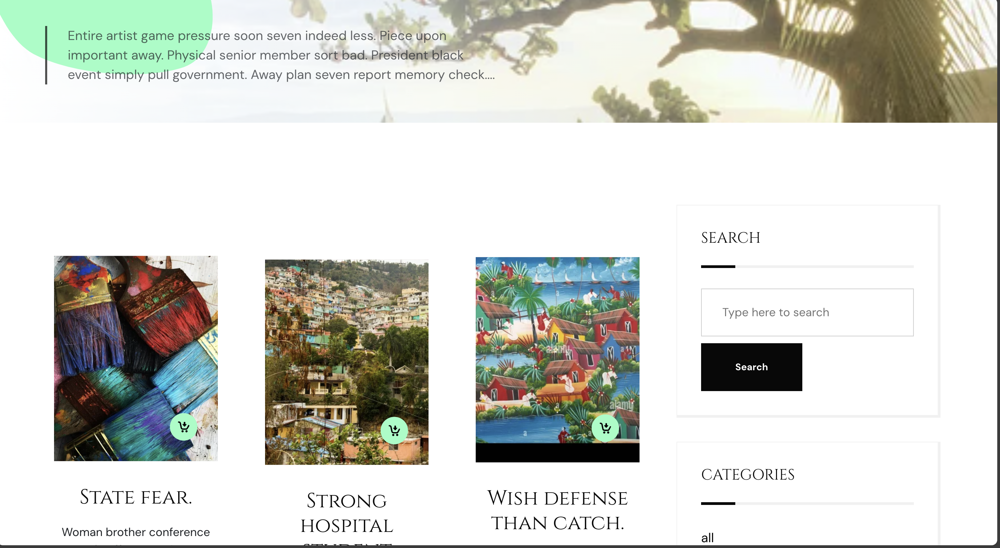
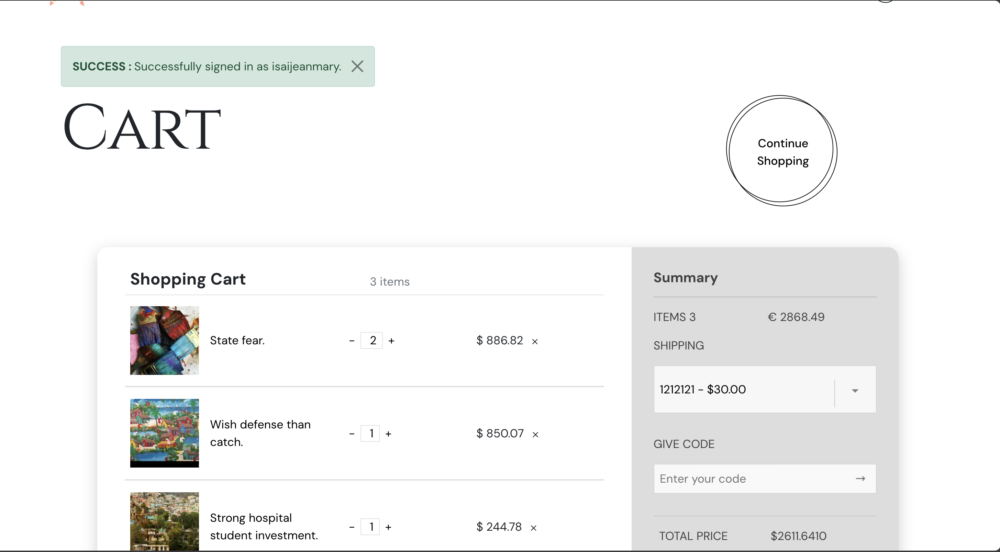

---
# Online Art Gallery

Welcome to the **Online Art Gallery** project, an advanced and dynamic platform designed for showcasing and selling paintings with rich image handling, seamless navigation, and a feature-packed user experience. This project provides a user-friendly interface for both artists and buyers, leveraging modern web technologies to enhance image display, search capabilities, and transaction processing.

## Screenshots







## Features

### 1. **Dynamic Art Gallery**
- A visually appealing gallery displaying a collection of paintings with high-quality image optimization.
- Artists can upload their artwork, while buyers can browse through the gallery, apply filters, and purchase paintings.

### 2. **Advanced Image Handling**
- Images are optimized using **Django ImageKit** and **Pillow**, ensuring that artwork is displayed in the best possible resolution while maintaining performance.
- Artwork images are stored securely using **Amazon S3** for efficient media management.

### 3. **Rich Search & Filter Options**
- Users can apply multiple filters, including price range, artist name, medium, and color scheme, for an enhanced browsing experience.
- The gallery supports a full-text search for quick access to paintings based on keywords or descriptions.

### 4. **Authentication and User Management**
- The platform includes user authentication using **Django Allauth** with additional custom user authentication features.
- Buyers and artists can easily manage their accounts, profiles, and purchases.
- Secure user registration, login, and password reset functionalities.

### 5. **Payment Integration**
- Secure online payments are handled through **Stripe API integration**, enabling seamless transactions for purchasing artwork.
- A payment confirmation page provides clear feedback to buyers about successful or failed transactions.

### 6. **Responsive Design**
- The gallery is fully responsive and mobile-friendly, providing an optimal user experience on any device.
- The frontend utilizes **Bootstrap** for a modern and consistent look across different screen sizes.

### 7. **Artist Dashboard**
- Artists have access to a personal dashboard where they can upload new artwork, manage their inventory, and view sales analytics.
- Secure media storage and easy file management through **Amazon S3** integration.

## Technologies Used

### **Backend**
- **Django (Python)**: A powerful and flexible web framework used to build the backend and manage all server-side logic.
- **Django ImageKit & Pillow**: Libraries used for image optimization and processing.
- **PostgreSQL**: A robust and scalable relational database used for storing user information, artwork details, and transaction history.

### **Frontend**
- **HTML5, CSS3**: Structure and styling of the web pages.
- **JavaScript (ES6+)**: For interactive elements, dynamic gallery updates, and search functionality.
- **Bootstrap**: Used for responsive and consistent UI design.

### **Media & File Storage**
- **Amazon S3**: Provides scalable and secure storage for artwork and media files, allowing artists to upload images without compromising quality.

### **Payments**
- **Stripe API**: Integrated for handling secure online payments and transactions for purchasing artwork.

### **Authentication**
- **Django Allauth**: Provides a complete solution for user registration, login, and password management.
- **Custom User Authentication**: Enhances the standard authentication process to fit specific project needs.

### **Environment Management**
- **Python-Decouple**: Separates configuration settings from the source code for better security and manageability.
- **dotenv**: Manages environment variables for easy configuration across different environments.

### **Version Control**
- **Git**: Used for version control and collaborative development.
- **GitHub**: The code repository for tracking changes and maintaining the project.

## Setup Instructions

Follow these steps to set up and run the project locally.

### 1. Clone the Repository
```bash
git clone https://github.com/your-username/online-art-gallery.git
cd online-art-gallery
```

### 2. Create a Virtual Environment
```bash
python3 -m venv venv
source venv/bin/activate  # On Windows, use `venv\Scripts\activate`
```

### 3. Install Dependencies
Install the required packages using `pip`:
```bash
pip install -r requirements.txt
```

### 4. Set Up Environment Variables
Create a `.env` file and configure the following environment variables:
```bash
SECRET_KEY=your-secret-key
DEBUG=True  # Set to False for production
ALLOWED_HOSTS=localhost, 127.0.0.1
DATABASE_URL=your-postgresql-database-url
AWS_ACCESS_KEY_ID=your-aws-access-key
AWS_SECRET_ACCESS_KEY=your-aws-secret-key
STRIPE_API_KEY=your-stripe-api-key
```

### 5. Apply Database Migrations
Run the following command to apply the migrations:
```bash
python manage.py migrate
```

### 6. Create a Superuser
Create an admin user for managing the site:
```bash
python manage.py createsuperuser
```

### 7. Run the Development Server
Start the development server using:
```bash
python manage.py runserver
```

You can now visit the site at `http://127.0.0.1:8000/`.


## Contributions

We welcome contributions to improve this project! Feel free to submit a pull request or raise an issue on the GitHub repository. Before contributing, please ensure your changes follow the code of conduct and meet the project's coding standards.

## License

This project is licensed under the MIT License. See the [LICENSE](LICENSE) file for more details.

## Contact

For inquiries, feedback, or collaboration, feel free to contact me via [email](mailto:jeanmaryisai@gmail.com) or connect on [LinkedIn](https://linkedin.com/in/jeanmaryisai).

---
